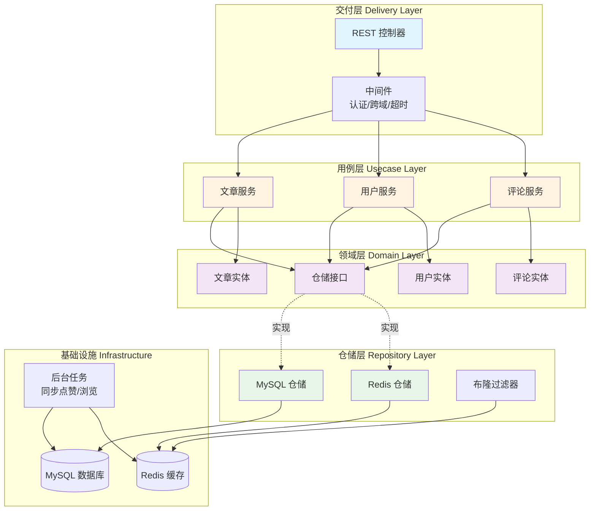

# Go Clean Architecture Blog Backend

> 基于 Go (Gin) + Clean Architecture 的高性能博客后端系统，集成了 Redis 缓存策略与持久化机制。


## 📖 项目简介 (Introduction)

本项目是一个严格遵循 **Clean Architecture (整洁架构)** 设计原则的博客后端服务。

相较于传统的 MVC 架构，本项目旨在解决业务逻辑与框架的高度耦合问题。通过分层设计（Domain, Usecase, Repository, Delivery），实现了高度的可测试性与可维护性。

项目重点实现了**高并发场景下的点赞系统**与**热榜聚合**，采用 Redis + MySQL 的混合存储策略，平衡了一致性与性能。

## ✨ 核心特性 (Features)

- **🏗 整洁架构**: 严格分离 Domain 层、Usecase 层与 Repository 层，依赖倒置。
- **🔥 高性能热榜**: 基于 Redis ZSet 实现的实时文章热度排行榜 (Daily Rank)。
- **👍 高并发点赞**: 
    - 使用 Redis Set 进行去重与计数，支持高并发写入。
    - 采用异步策略将缓存数据回写至 MySQL (Persistence)，防止数据丢失。
- **🔐 用户认证**: 基于 JWT 的用户登录与注册机制。
- **🐳 容器化部署**: 完整的 Docker & Docker Compose 支持，一键启动。

## 🛠 技术栈 (Tech Stack)

- **语言**: Golang (1.21+)
- **Web 框架**: Gin
- **ORM**: GORM v2
- **数据库**: MySQL 8.0
- **缓存/消息**: Redis 7.0
- **配置管理**: Viper
- **日志**: Logrus

## 📐 架构设计 (Architecture)

本项目采用标准的 4 层架构设计：

1.  **Models (Domain)**: 定义核心业务实体（Article, User），不依赖任何外部库。
2.  **Repository**: 负责数据存取（MySQL/Redis），实现 Domain 层定义的接口。
3.  **Usecase**: 核心业务逻辑流程（如：计算热度分值、组装文章详情）。
4.  **Delivery (HTTP)**: 负责处理 HTTP 请求，参数校验，调用 Usecase。



**依赖方向**: 交付层 → 用例层 → 仓储接口 ← 仓储实现 → 基础设施

核心原则：**依赖倒置** (DIP) - 用例层依赖领域层定义的接口，而非具体实现。

## 🚀 快速开始 (Getting Started)

### 前置要求
- Go 1.21+
- Docker & Docker Compose (推荐)

### 方式一：使用 Docker 启动 (推荐)

```bash
# 1. 克隆仓库
git clone https://github.com/Guyuepp/Go-Clean-Architecture-Blog.git
cd Go-Clean-Architecture-Blog

# 2. 启动服务 (包含 MySQL 和 Redis)
make up

# 3. 服务将运行在 :9090 端口

```

### 方式二：本地运行

1. 修改 `.env` 中的数据库配置。
2. 运行项目：

```bash
go mod tidy
go run main.go

```

## 📝 API 文档

<!-- API 列表:
| 方法 | 路径 | 参数 | 描述 |
| --- | --- | --- | --- |
| GET | `/articles` |  | 获取文章列表 |
| GET | `/articles/:id` | id(path) | 获取文章详情 |
| GET | `/articles/ranks` | type(daily|historical), limit | **获取今日/历史热榜** |
| POST | `/articles` | JSON | **创建文章** (需登录) |
| POST | `/articles/:id/like` |  | **点赞文章** (需登录) |
| DELETE | `/articles/:id/like` |  | **取消点赞文章** (需登录) |
| POST | `/login` | JSON | 用户登录 |
| POST | `/register` | JSON | 用户注册 |

POST /articles 请求体定义
```json
{
  "title": "文章标题",
  "content": "文章内容"
}
```

POST /login 请求体定义
```json
{
  "username": "your_username",
  "password": "your_password"
}
```

POST /register 请求体定义
```json
{
  "username": "your_username",
  "password": "your_password",
  "name": "your_name"
}
``` -->
### 🔐 Auth 模块

| 方法 | 路径 | 描述 |
| --- | --- | --- |
| `POST` | `/register` | 注册新用户 (`username`, `password`, `name`) |
| `POST` | `/login` | 获取 JWT Token |

### 📝 Article 模块

| 方法 | 路径 | Auth | 描述 |
| --- | --- | --- | --- |
| `GET` | `/articles` | ❌ | 分页获取文章列表 |
| `GET` | `/articles/:id` | ❌ | 获取指定 ID 的文章详情 |
| `POST` | `/articles` | ✅ | 创建文章 (Body: `title`, `content`) |
| `POST` | `/articles/:id/comments` | ❌ | 获取指定 ID 的文章评论 |
| `POST` | `/articles/:id/comments` | ✅ | 在指定 ID 的文章下发布评论或者回复 |

### 🔥 Interaction & Analytics (Redis Powered)

| 方法 | 路径 | 描述 |
| --- | --- | --- |
| `GET` | `/articles/ranks` | 获取热榜。参数 `type`: `daily` (今日), `historical` (历史) |
| `POST` | `/articles/:id/like` | 点赞文章。基于 Redis Set 去重实现 |
| `DELETE` | `/articles/:id/like` | 取消点赞 |


## 💡 难点与解决方案 (Highlights)

### 点赞数据的一致性

为了应对高并发点赞，直接写 MySQL 会造成巨大压力。  
**解决方案**: 采用 `Write-Back` (回写) 策略。先在 Redis 中进行原子计数，通过定时任务/异步协程将增量数据同步至 MySQL，实现了性能与最终一致性的平衡。


## 👏 致谢 (Acknowledgements)

本项目的初始架构参考了 [bxcodec/go-clean-arch](https://github.com/bxcodec/go-clean-arch)。感谢其对 Clean Architecture 的精彩实现与分享。  
This project structure is adapted from [bxcodec/go-clean-arch](https://github.com/bxcodec/go-clean-arch). Special thanks for the architectural inspiration.